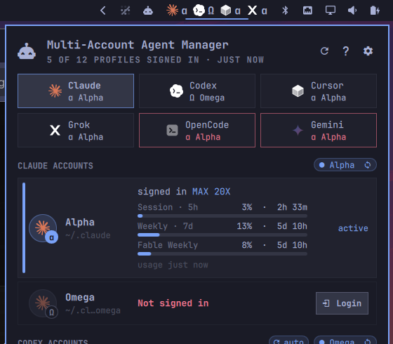
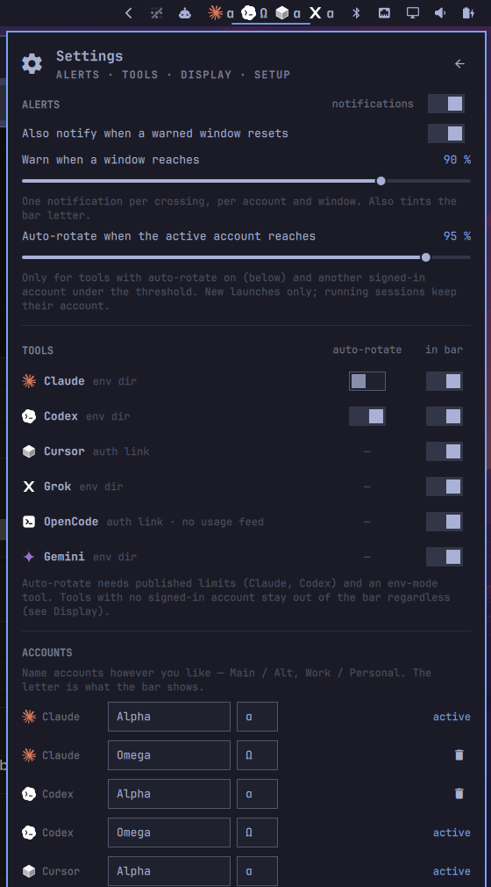
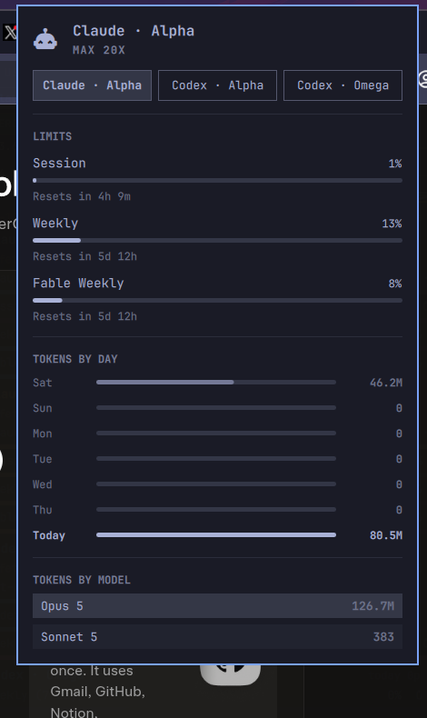

# Multi-Account Agent Manager — an Omarchy bar plugin

Run more than one subscription per AI coding CLI on the same machine and
switch, sign in and watch limits from the bar.

Supports **Claude Code, Codex, Grok, Cursor CLI, Gemini CLI and OpenCode**
out of the box (Copilot and Pi ship as opt-in definitions), and any other
CLI you describe in a small JSON file.




*Bar: one mark per signed-in tool with the active profile's letter. Panel: chips, per-profile cards with meters, Use / Login / Shell. Tokyo Night shown; every colour follows your Omarchy theme.*

## What you get

- **Bar**: one mark per tool you are signed in to (at least one profile),
  with the active profile's letter (`α`, `Ω`, …). Tools with no login stay
  out of the bar until you sign one in from the panel (`barShowUnsigned`
  shows them anyway). The letter turns urgent when the active profile needs
  a login, and accent when one of its limits is past the warning threshold.
- **Panel**: one tab per tool (mark, active letter, tint), and for the
  selected tool one card per account with masked email, plan, session/weekly
  meters and reset times. **Login** is always visible; **Use** and **Shell**
  appear when you hover or move the cursor onto a card. The `● Alpha` pill
  cycles the tool's active account. Keys: `j`/`k` select, `Enter` use,
  `i` sign in, `t` terminal, `h`/`l` previous/next tool, `a` all tools /
  one tab, `r` refresh, `s` settings, `e` edit the registry, `?` legend,
  `Esc` back/close. Accounts whose CLI publishes no limits (Grok, Cursor,
  Gemini) get an activity meter instead — today's prompts/tokens against the
  busiest day of the week, estimated from local session files.
- **Settings page** (gear or `s`): alert and auto-rotate thresholds as
  sliders, notifications on/off, per-tool auto-rotate and in-bar switches,
  email display, bar options, the setup checklist with Run/Remove, and the
  registry editor. Every control writes through `agent-acct config` or
  `omarchy bar set`, so the CLI and Omarchy's own settings stay the source of
  truth.

  
- **Alerts**: a notification when a profile's window crosses the warning
  threshold (default 85 %), once per crossing.
- **Auto-rotate** (opt-in per tool, `󰑐 auto` chip): when the active profile
  passes the rotate threshold (default 90 %) and another signed-in profile has
  headroom, the tool switches to it. New launches only — running sessions
  never change.
- **Stock Agents panel integration**: Omarchy's own `omarchy.agents` widget
  shows one tab per account ("Claude α", "Codex Ω") with its full charts,
  because this plugin writes per-account usage records in the format the
  stock collectors use. Accounts appear there once they have recorded usage.

  
- **CLI**: everything the bar does is `agent-acct …` in a terminal.

## Install

```bash
omarchy plugin add https://github.com/RationalSeer/omarchy-multi-account-agent-manager --enable
```

The widget works immediately. Open the panel and press **Run setup** (or run
`agent-acct setup` after the first step) to add the optional, reversible
wiring:

| Step | What it does | Undo |
|---|---|---|
| Registry | `~/.config/agent-accounts/accounts.json`, one *Alpha* profile per discovered CLI (your current login) and an empty *Omega* | delete |
| PATH | `~/.local/bin/agent-acct` → the plugin's `bin/agent-acct` | `setup --remove` |
| Bash hook | two lines in `~/.bashrc`; new **and already-open** terminals follow a switch at their next prompt, never overriding a value you exported yourself | `setup --remove` |
| Session env | `~/.config/uwsm/env.d/20-agent-accounts` so keybind / menu launches start with the active profiles; `use` also pushes the env into the running Hyprland session via `hyprctl` | `setup --remove` |
| Timer | `systemd --user` timer refreshing usage every 15 min | `setup --remove` |
| Stock tabs | hides the stock single Claude/Codex tabs so profiles are not shown twice | `setup --remove` |

`agent-acct setup --remove --purge` also deletes the registry, slots and
records. Your CLIs' own directories are never touched.

## Remove

```bash
agent-acct setup --remove          # undo the optional wiring (keeps your profiles)
agent-acct setup --remove --purge  # also delete the registry, slots and usage records
omarchy plugin remove io.github.rationalseer.multi-account-agent-manager
```

Your CLIs' own directories (`~/.claude`, `~/.codex`, …) and any `-omega`
profile directories are never deleted; remove those yourself if you no longer
want the second account's data.

## How a switch works

Every tool is one of two kinds:

- **env** (Claude, Codex, Grok, Gemini): the CLI reads its config directory
  from an environment variable (`CLAUDE_CONFIG_DIR`, `CODEX_HOME`,
  `GROK_HOME`, `GEMINI_CLI_HOME`). A profile is a directory; Alpha is the
  CLI's default one, Omega is `~/.<tool>-omega` with shared config
  (`settings.json`, skills, …) symlinked from Alpha. `use` rewrites
  `active.env`; the bash hook and the session env carry it. Explicit values
  always win, and `claude-omega` / `codex-alpha` aliases give one-off
  overrides.
- **link** (Cursor, OpenCode): the CLI reads one fixed auth file
  (`~/.config/cursor/auth.json`, `~/.local/share/opencode/auth.json`). A
  profile is a slot under `~/.config/agent-accounts/slots/`, and the fixed
  path is a symlink that `use` re-points. **Login** makes the profile active
  first so the sign-in lands in the right slot. *Switch these with no session
  of that tool open* — a running session that refreshes its token would write
  it into whichever slot is linked at that moment.

Running sessions of any tool keep the account they started with.

## Adding a tool

Drop `~/.config/agent-accounts/tools/<id>.json` (same shape as the files in
`tools/`; a file with an existing id overrides it):

```json
{
  "id": "foo", "name": "Foo", "bin": "foo",
  "mode": "env", "envVar": "FOO_HOME", "defaultDir": "~/.foo",
  "credFile": "auth.json",
  "login": ["foo", "login"], "logout": ["foo", "logout"],
  "shared": ["config.toml"],
  "identity": { "jq": "{signedIn: ((.token // \"\") | length > 0), email: (.email // \"\"), plan: \"\", expiresAt: null, expired: false}" },
  "collector": "local",
  "localUsage": { "dirs": ["~/.foo/sessions"] }
}
```

`order` sets the tab position (lower first). `identity.jq` runs over the credential file with `$now` (ms) bound and must
return `{signedIn, email, plan, expiresAt, expired}`. `collector` is
`stock:<omarchy-agent-usage-…>` for a CLI Omarchy already collects, `local`
to estimate from session files in `localUsage.dirs`, or `null`. A tool shows
up only when its binary is on `PATH` and the definition is `enabled`.

## Settings

`omarchy bar set io.github.rationalseer.multi-account-agent-manager <key> <value> --json`

| Key | Default | |
|---|---|---|
| `statusIntervalSec` | 300 | how often the panel re-reads `agent-acct status` |
| `limitWarnPercent` | 85 | bar / meter tint threshold |
| `showGlyphs` | true | show α/Ω letters in the bar |
| `compactBar` | false | letters only for tools that need attention |
| `barShowUnsigned` | false | also show tools with no signed-in profile in the bar |
| `emailDisplay` | masked | `masked` (cyc…@example.com), `hidden`, or `full` |
| `showAllTools` | false | every tool's accounts at once instead of one tab (`a` in the panel) |

Thresholds for alerts and auto-rotate live in the registry (the settings page
edits the same values): `agent-acct config alerts warnAt 0.85`,
`agent-acct config alerts rotateAt 0.9`, `agent-acct config alerts enabled off`,
`agent-acct config <tool> autoRotate on`, `agent-acct config <tool> barHidden on`.

## Privacy and security

- Reads only what it shows: presence/expiry of a credential, the account email
  (masked by default, `emailDisplay` can hide it entirely) and plan. Tokens are
  never printed, copied or logged.
- No network requests of its own. Rate limits come from Omarchy's stock
  collectors (Claude, Codex); everything else is estimated from local session
  files and labelled as such.
- No sudo or pkexec is required. Everything lives in your home directory; the
  only system integration is a `systemd --user` timer that you install
  yourself with **Run setup** and remove with `agent-acct setup --remove`.
- Nothing is changed without consent: the widget itself only reads. `setup`
  (button or command) is the explicit step that edits `~/.bashrc`, adds the
  session env file and timer, and hides the stock single-account tabs; each
  step is listed with ✓/✗ and reversible.
- Tool definitions are data, but their `login`/`logout`/`emailCommand` arrays
  are executed with the profile's environment. Only add definitions under
  `~/.config/agent-accounts/tools/` that you trust; the plugin never evaluates
  strings from them as shell code, and profile paths are restricted to a safe
  character set.
- Registry, `active.env` and profile slots are created with owner-only
  permissions (`0600` / `0700`).

## Known limits

- The stock Agents widget's own right-click "launch agent" runs from the
  shell process, whose environment is fixed at session start; it follows a
  switch only after `omarchy restart shell`. This plugin's Shell button and
  keybind launches follow immediately.
- Copilot stores its token in the system keyring when one exists, which all
  profiles would share; its definition ships disabled.
- Local usage estimates depend on each CLI's session format and may be empty.

## IPC

`omarchy-shell io.github.rationalseer.multi-account-agent-manager <open|close|toggle|settings|tab <tool>|refresh|next <tool>|status>`

## License

MIT. The Claude and Codex marks are the ones shipped with Omarchy's
first-party Agents plugin (MIT); the other marks are simple original shapes
drawn to be reminiscent of each product, not copies of their logos.
